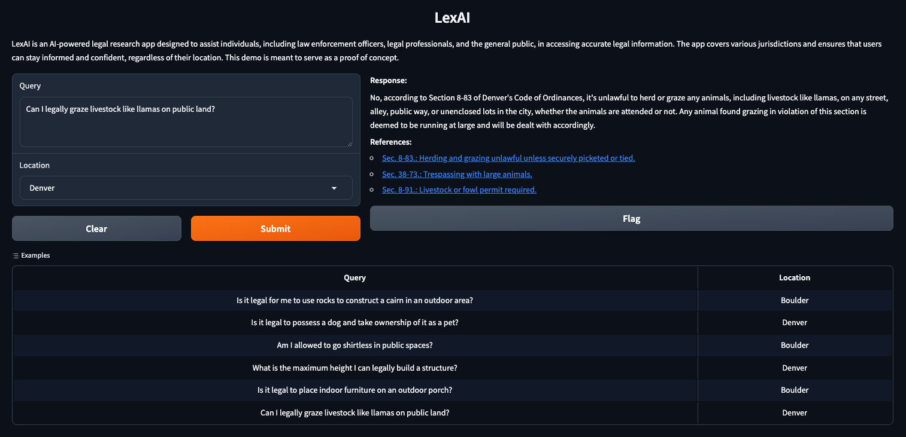

# LexAI

## AI-Powered Legal Research Assistant

LexAI is an AI assistant that delivers jurisdiction-specific legal information by integrating OpenAI's language models with local vector embeddings. The system uses semantic search to surface relevant legal references and provides a web interface for users to query the model interactively.



---

## Features

- **GPT-4 Integration**: Uses OpenAI's GPT-4 to generate concise, relevant legal responses.
- **Jurisdiction-Specific Search**: Preloaded embeddings for Boulder County and Denver, Colorado.
- **Semantic Search Engine**: Uses cosine similarity for embedding-based document retrieval.
- **Modern Web Interface**: Built with Gradio for real-time interaction.
- **Modular Design**: Clean separation of logic for UI, inference, and API handling.
- **Fully Tested**: Unit tests cover embedding loading, matching logic, and OpenAI API integration.
- **Developer Ready**: Comes with dev tools like Ruff, Black, pytest, mypy, and test coverage support.

---

## Getting Started

### 1. Clone the Repository

```bash
git clone https://github.com/alexulanch/lexai.git
cd lexai
```

### 2. Install Git LFS (if needed)

This project uses [Git LFS](https://git-lfs.github.com/) to manage large files such as `.npz` embedding data.

```bash
git lfs install
git lfs pull
```

### 3. Install Dependencies

```bash
pip install -r requirements.txt
# For development tools:
pip install -r dev-requirements.txt
```

### 4. Set Up Environment

Create a `.env` file in the root directory:

```dotenv
OPENAI_API_KEY=your_openai_api_key
BOULDER_EMBEDDINGS_PATH=lexai/data/boulder_embeddings.npz
DENVER_EMBEDDINGS_PATH=lexai/data/denver_embeddings.npz
```

---

## Running the App

```bash
python -m lexai
```

Then open `http://127.0.0.1:7860` in your browser.

---

## Project Structure

```
.
├── LICENSE
├── README.md
├── app.py # Entrypoint for Hugging Face Space
├── assets/
│   └── screenshot.png
├── dev-requirements.txt
├── lexai/
│   ├── __main__.py
│   ├── config.py
│   ├── core/
│   │   ├── data_loader.py
│   │   ├── match_engine.py
│   │   └── matcher.py
│   ├── data/
│   │   ├── boulder_embeddings.npz
│   │   └── denver_embeddings.npz
│   ├── services/
│   │   ├── lexai_service.py
│   │   └── openai_client.py
│   └── ui/
│       ├── formatters.py
│       └── gradio_interface.py
├── pyproject.toml
├── pytest.ini
├── requirements.txt
└── tests/
    ├── test_data_loader.py
    ├── test_matcher.py
    └── test_openai_client.py
```

---

## Testing

To run tests:

```bash
pytest
```

To check code coverage:

```bash
pytest --cov=lexai --cov-report=term
```

To lint:

```bash
ruff check .
```

To format code:

```bash
black .
```

---

## License

MIT License

---

## Acknowledgements

- Built with [Gradio](https://gradio.app)
- Powered by [OpenAI](https://openai.com)
